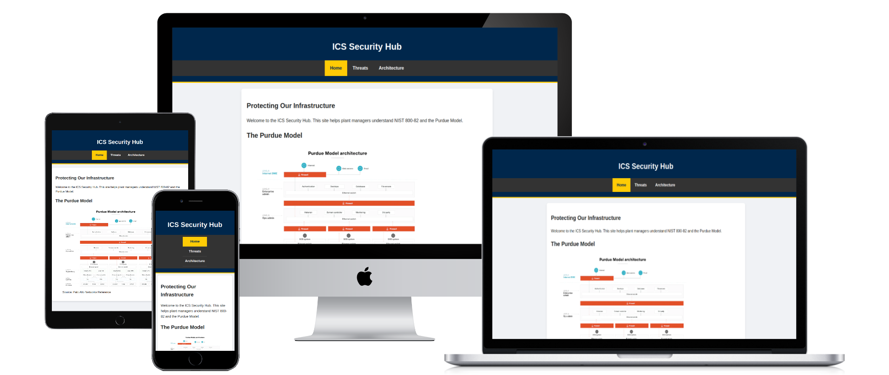

# ICS Security Hub 

A professional web resource dedicated to the security and architecture of Industrial Control Systems (ICS).

**Live Site:** [View Project Here](https://jackelinebdm.github.io/ics-security-hub/)

## Responsive Design Preview
The ICS Security Hub is designed to be fully responsive across all modern devices.

## Technical Quality Scorecard (Google Lighthouse)

| Category | Score | Status |
| :--- | :--- | :--- |
| **Accessibility** |  | Pass |
| **Best Practices** |  | Pass |
| **Performance** |  | Pass |
| **SEO** |  | Optimized |

---

## UX (The 5 Planes)

### 1. Strategy Plane
**Goal:** To provide a professional web resource for ICS security professionals to understand the Purdue Model and OT protection.
- **User Needs:** Quick access to security standards (NIST) and architectural models.
- **Business Goal:** Build a high-performance, accessible information hub.

### 2. Scope Plane
**Features Included:**
- 3-Page Structure (Home, Architecture, Threats).
- Purdue Model Reference Gallery.
- Responsive Navigation Bar.

### 3. Structure Plane
**Information Architecture:**
- **Level 1:** Home (Executive overview of ICS security).
- **Level 2:** Architecture (Deep dive into the Purdue Model).
- **Level 3:** Threats (Analysis of common attack vectors).

### 4. Skeleton Plane
**Wireframes:**
I used Figma to design mobile-first layouts, ensuring technical diagrams remain clear on small screens.

### 5. Surface Plane
**Visual Design:**
- **Colors:** Professional dark-theme palette for high contrast.
- **Typography:** Clean sans-serif fonts for technical clarity.
- **Key Diagram:** 

---

## User Stories
* **As a Plant Manager:** I want to see a high-level visual of network layers to understand where security investments are required.
* **As a Security Engineer:** I want a mobile-responsive resource to verify security best practices while on the factory floor.

---

## Technologies and Deployment
* **Languages:** HTML5, CSS3.
* **Tools:** VS Code, GitHub Desktop, Figma, Google Lighthouse.
* **Hosting:** Deployed via GitHub Pages.

---

## Testing
For all technical testing results and validator screenshots, please refer to the [TESTING.md](TESTING.md) file.

---

## Credits and Attribution
* **Media:** Purdue Model diagram adapted from [Palo Alto Networks](https://www.paloaltonetworks.com/).
* **Tools:** [Website Mockup Generator](https://websitemockupgenerator.com/) was used to create the responsive design preview.
* **Technical Content:** Standards derived from [NIST SP 800-82](https://csrc.nist.gov/pubs/sp/800/82/r3/fp) and [NIST SP 1800-10](https://www.nccoe.nist.gov/projects/protecting-information-and-system-integrity-industrial-control-systems).
* **Educational Context:** Developed as part of the [Code Institute](https://codeinstitute.net/) Milestone 1 Project.
