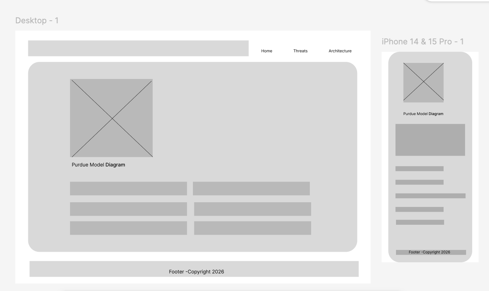

# ICS Security Hub

A professional web resource dedicated to the security and architecture of Industrial Control Systems (ICS).

## Technical Quality Scorecard (Google Lighthouse)

| Category | Score | Status |
| :--- | :--- | :--- |
| **Accessibility** |  | Pass |
| **Best Practices** |  | Pass |
| **Performance** |  | Pass |
| **SEO** |  | Optimized |

---

## Project Highlights
- Framework: Pure Semantic HTML5 & CSS3
- Compliance: 100% W3C Validated Markup
- Design: Mobile-First Responsive Architecture
- Version Control: Managed via GitHub

## Core Modules
- Home: Executive overview of ICS security.
- Architecture: Deep dive into the Purdue Model and Network Segmentation.
- Threats: Analysis of common attack vectors in Industrial environments.

---
*Developed as part of the TM470 / CI Project - Milestone 1.*

## Design: Wireframes
To plan the responsive layout, I created wireframes for Desktop and Mobile views using Figma. 

## Credits and Attribution
* **Media:** Purdue Model diagram adapted from [Palo Alto Networks](https://www.paloaltonetworks.com/cyberpedia/what-is-the-purdue-model-for-ics-security).
* **Technical Content:** Standards derived from [NIST SP 800-82](https://doi.org/10.6028/NIST.SP.800-82r3) and [NIST SP 1800-10](https://doi.org/10.6028/NIST.SP.1800-10).