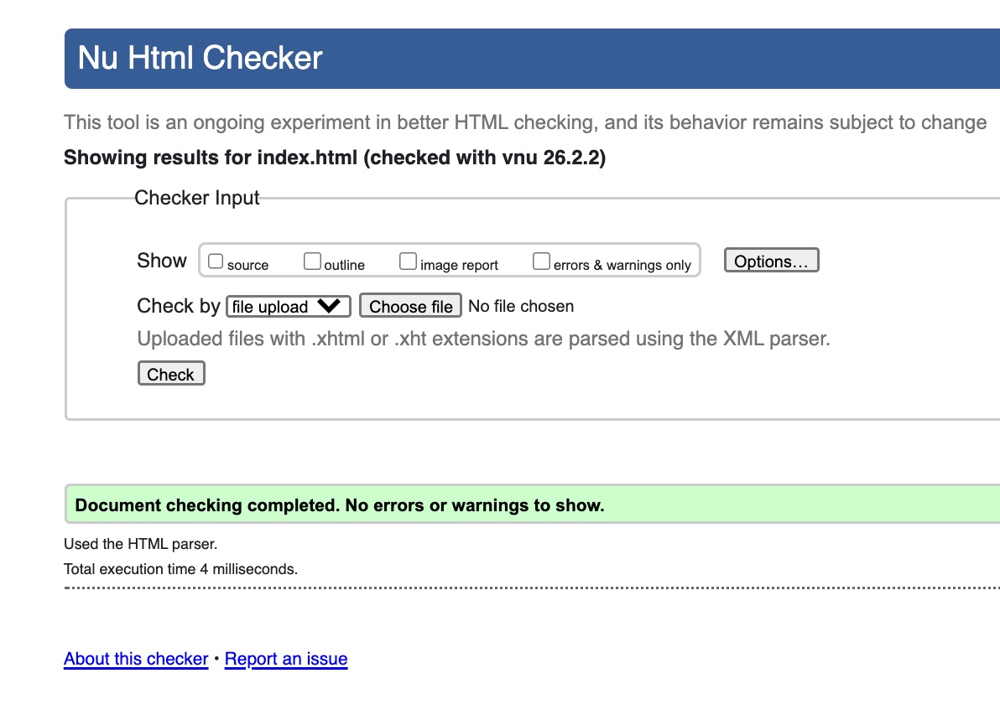
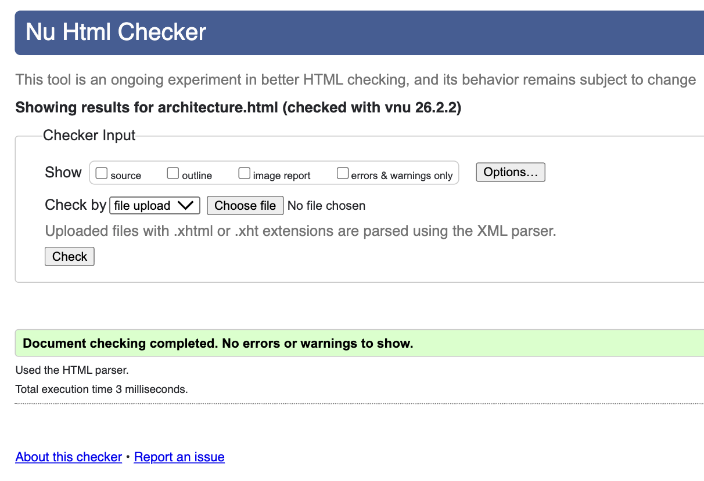
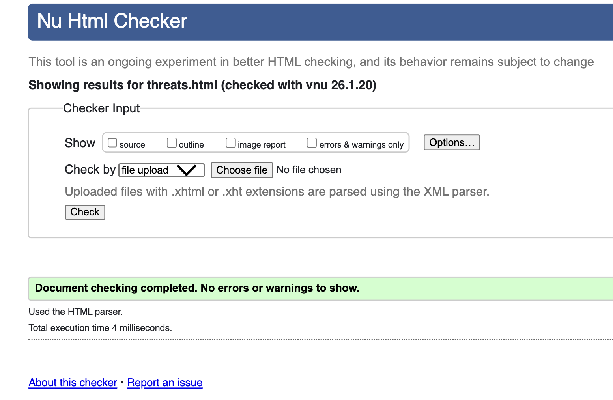
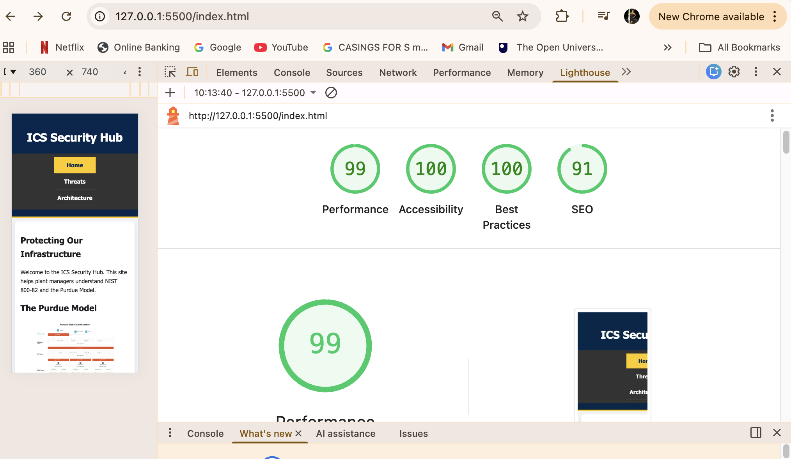
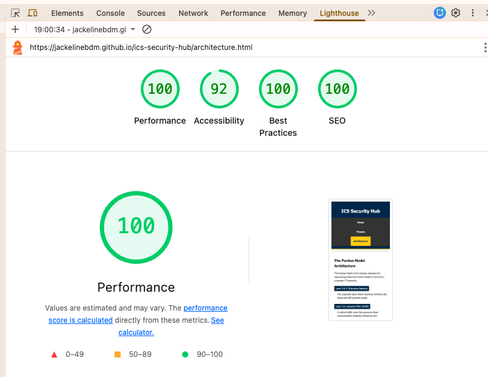
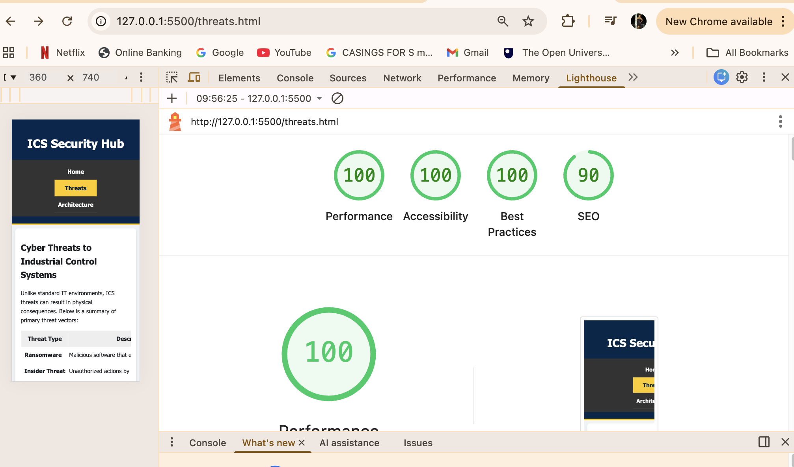
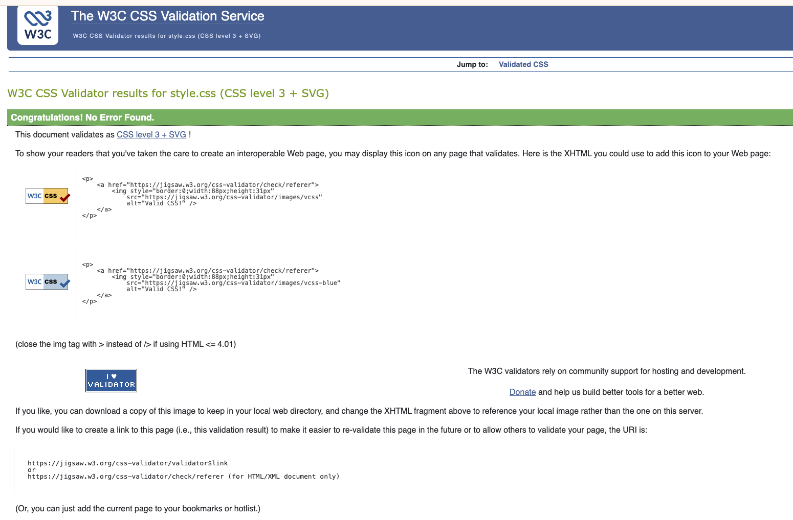

# Testing - ICS Security Hub

Below is the detailed evidence for the scores reported in the README.

## HTML Validation
The following images show the W3C validation results for the HTML pages, confirming zero errors across the project.

### W3C Validation Pass for Index

### W3C Validation Pass for Architecture

### W3C Validation Pass for Threats

---

## Lighthouse Scores
The following images show the Lighthouse performance scores for the pages.

### Lighthouse Score for Home Mobile

### Lighthouse Score for Architecture

### Lighthouse Score for Threats

### W3C CSS Validator
I validated the `style.css` file using the W3C Jigsaw Validator. It passed with no errors.

