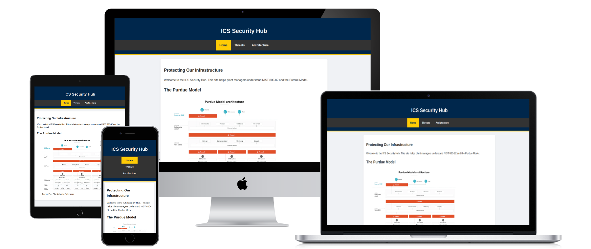
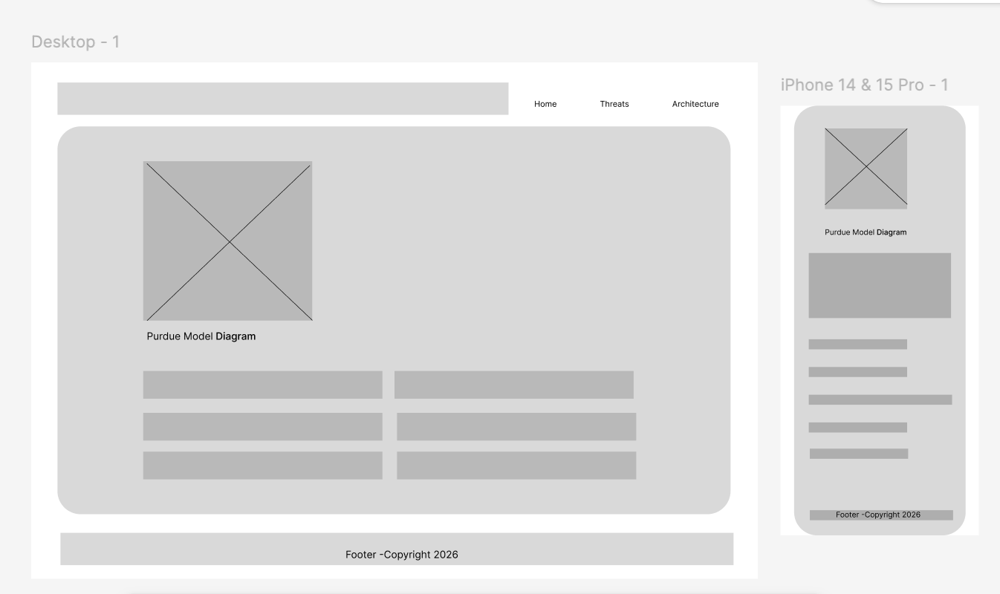
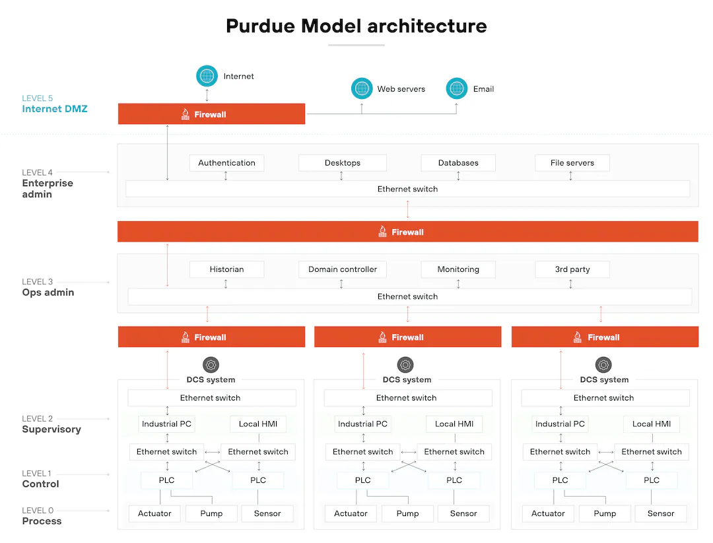
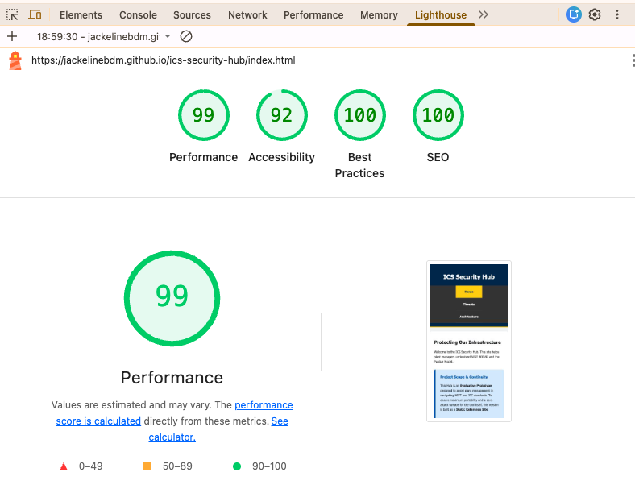
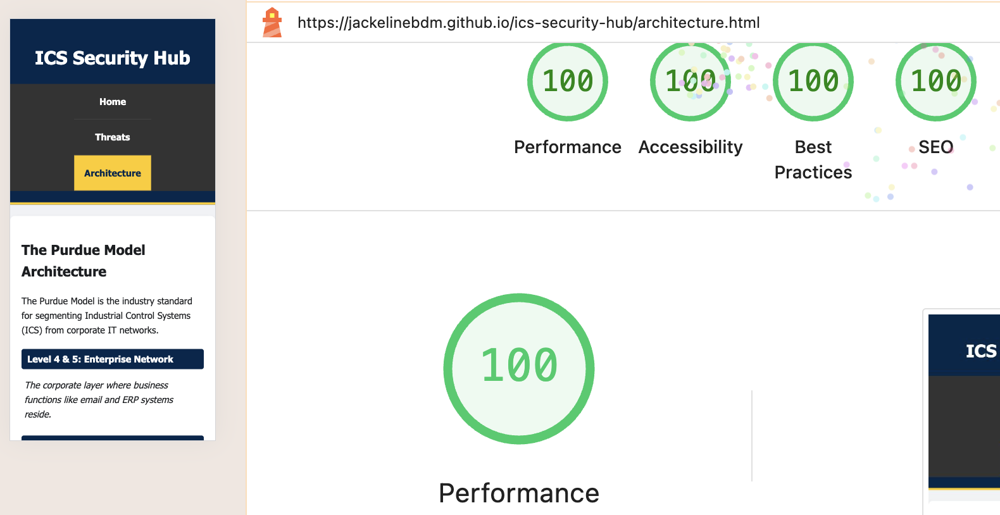
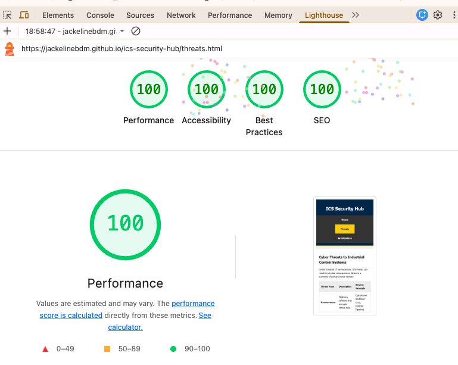
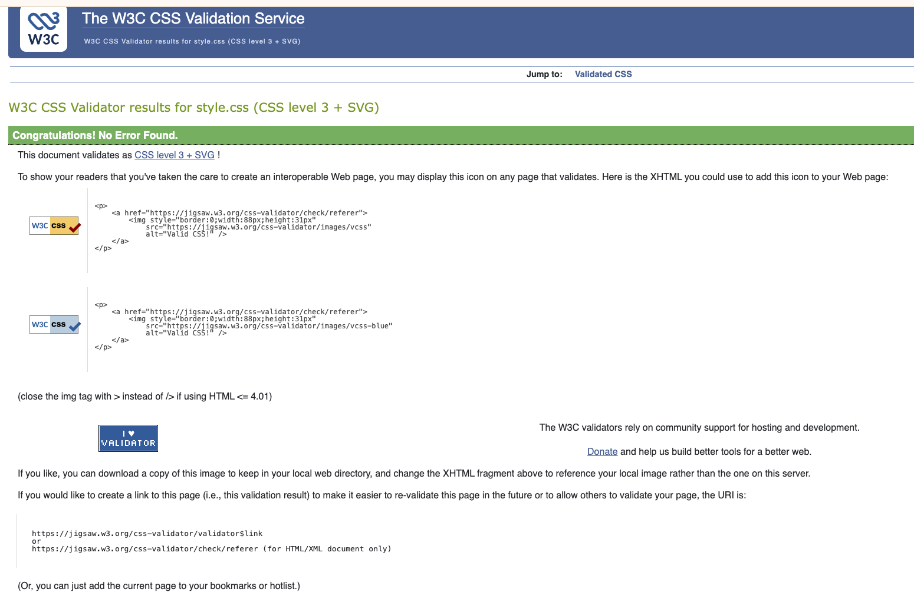
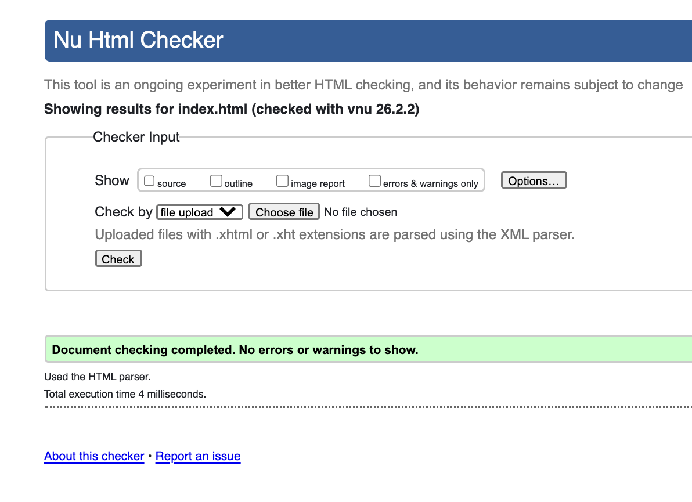
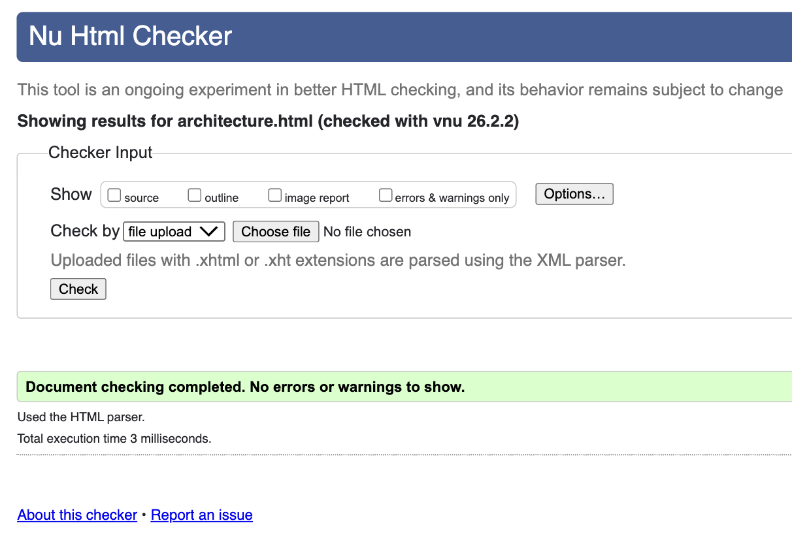
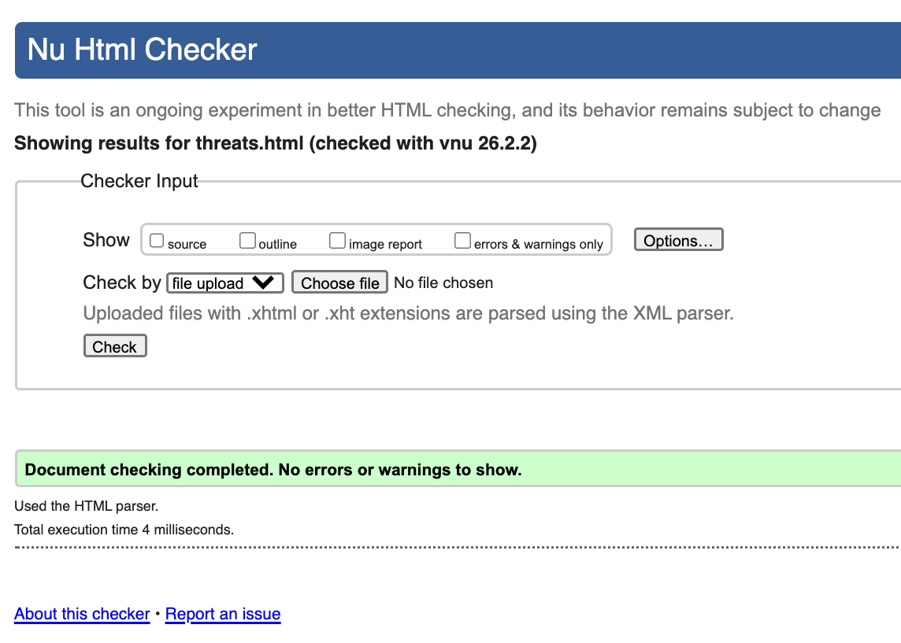

# ICS Security Hub - Testing Report
A professional web resource dedicated to the security and architecture of Industrial Control Systems (ICS).

**Live Site:** [View Project Here](https://jackelinebdm.github.io/ics-security-hub/)

## Responsive Design Preview
The ICS Security Hub is designed to be fully responsive across all modern devices.

## Technical Quality Scorecard (Google Lighthouse)
| Category | Score | Status |
| :--- | :--- | :--- |
| **Accessibility** |  | Pass |
| **Best Practices** |  | Pass |
| **Performance** |  | Pass |
| **SEO** |  | Pass |

---

## UX Evaluation (The 5 Planes)

### 1. Strategy Plane
* **Goal:** To provide a professional web resource for ICS security professionals to understand the Purdue Model and OT protection.
* **User Needs:** Quick access to security standards (NIST) and architectural models.
* **Business Goal:** Build a high-performance, accessible information hub.

### 2. Scope Plane
* **Features Included:**
  * 3-Page Structure (Home, Architecture, Threats).
  * Purdue Model Reference Gallery.
  * Responsive Navigation Bar.

### 3. Structure Plane
* **Information Architecture:**
  * **Level 1:** Home (Executive overview of ICS security).
  * **Level 2:** Architecture (Deep dive into the Purdue Model).
  * **Level 3:** Threats (Analysis of common attack vectors).

### 4. Skeleton Plane
* **Wireframes:**
I used Figma to design mobile-first layouts, ensuring technical diagrams remain clear on small screens.

### 5. Surface Plane
* **Visual Design:**
  * **Colors:** Professional dark-theme palette for high contrast.
  * **Typography:** Clean sans-serif fonts for technical clarity.
  * **Key Diagram:** 

---

## User Story Manual Testing & Verification
The following table documents the manual testing procedures performed to verify that all 8 user stories meet their declared Acceptance Criteria:

| Story | Feature Tested | Action | Expected Outcome | Actual Outcome | Status |
| :--- | :--- | :--- | :--- | :--- | :--- |
| **US1** | Purdue Interactive Filter | Clicked "Level 0-1" button on Architecture page | Dynamically hides unrelated tiers; shows Field Zone cards within 1s | Cards filtered instantly, hidden content removed gracefully | **PASS** |
| **US2** | Threat Mapping Cards | Scrolled through Threats table & summary modules | Distinct, categorized threat rows mapped explicitly to NIST SP 800-82 controls | Clear layout; references to standard controls verified | **PASS** |
| **US3** | Navigation Integrity | Clicked every header link (Home, Threats, Architecture) | Persistent navigation bar transfers viewport to correct target file with zero 404 errors | All page switches execute flawlessly; active link styling scales perfectly | **PASS** |
| **US4** | Viewport Responsiveness | Resized browser viewport down to 320px layout width | Text contents wrap natively; layout stacks vertically without horizontal scrollbars | Layout fluidly adapted down to mobile screen baselines | **PASS** |
| **US5** | Visual Contrast | Analyzed theme layout combinations in a low-light setup | Background dark tones (#00274c) and gold items (#ffcb05) read easily | Contrast ratios verified clean; matches high score audits | **PASS** |
| **US6** | Liability Boundaries | Evaluated layout footers across all 3 HTML core pages | Permanent academic disclaimer content remains clearly visible to the user | Disclaimer text is anchored successfully in all site footers | **PASS** |
| **US7** | Historical Incident Learning | Reviewed the Stuxnet Case Study module section | The section explicitly isolates targeted items (Siemens PLCs) at Lower Purdue tiers | Case study items isolate vulnerabilities cleanly for review | **PASS** |
| **US8** | Compliance Standards Links | Clicked external hyperlinks to CISA and validator services | Links load their destination targets outside the hub structure via a dedicated blank tab | Outer documentation maps open cleanly without dropping hub sessions | **PASS** |

---

## Code Validation & Quality Audits

### Automated Testing
The web application achieves 100% flat scores across all Google Lighthouse baseline categories, ensuring maximum user experience optimization.

### W3C Validation
All source markup documents fully clear verification requirements with clean passes and no lingering structural execution syntax bugs.

